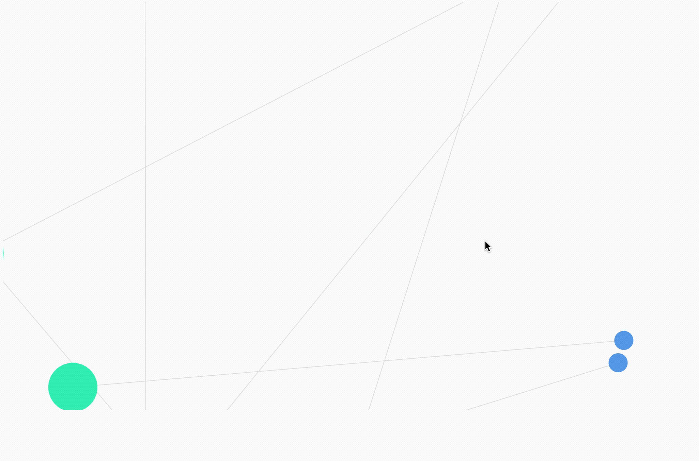
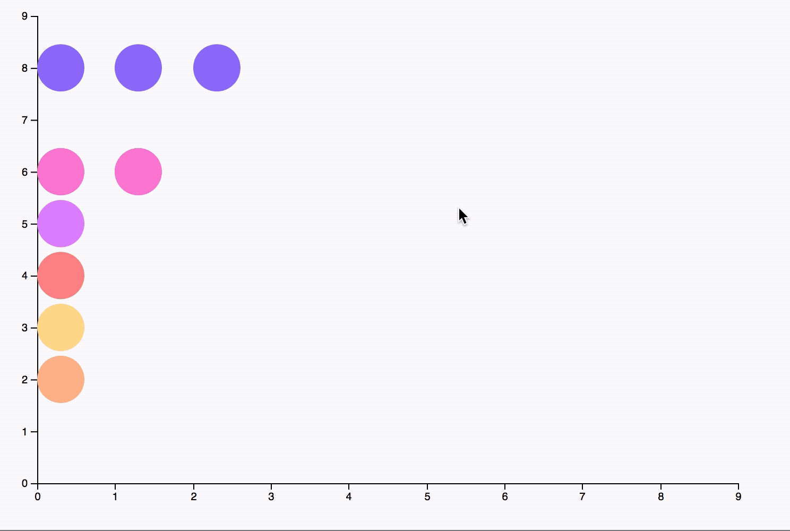

# d3-prototype
These are graph prototypes built in d3 for Clarity. Clarity is a personal information management tool 
that uses visual representations to help individuals track important information. With this tool, you can upload overarching topics with specific perspectives. You can also add sources to back up all the perspectives. I've worked on this project since June 2017. Clarity is currently in private alpha but more information can be found at https://www.michelle.codes/work/clarity/.

*Philosophies Graph*  
This graph shows the overarching topics (green) and specific ideas (blue) within each topic through a visual graph to clearly show the links and categorize the information.

*Sources Graph*  
This graph shows all of the sources used within your tool. The key isn't shown, but each color correlates to a type of source, such as book, talk, podcast, etc. This utility of this graph allows for the beginning of analysis of your sources, separating by type (the process which will also be used to separate sources based on author gender and/or ethnicity) as well as allowing the influence of each source be toggled. In the initial layout, the circles are different sizes based on how many perspectives the source supports. However, you can also change all the sizes to be the same static size which allows for a slightly different set of analysis.

*Dot Plot Graph*  
This graph will be used, without the axes, to show combinations of filters that can't be accomplished with the above Sources Graph. For example, the sources could be lined up to show both gender and ethnicity

